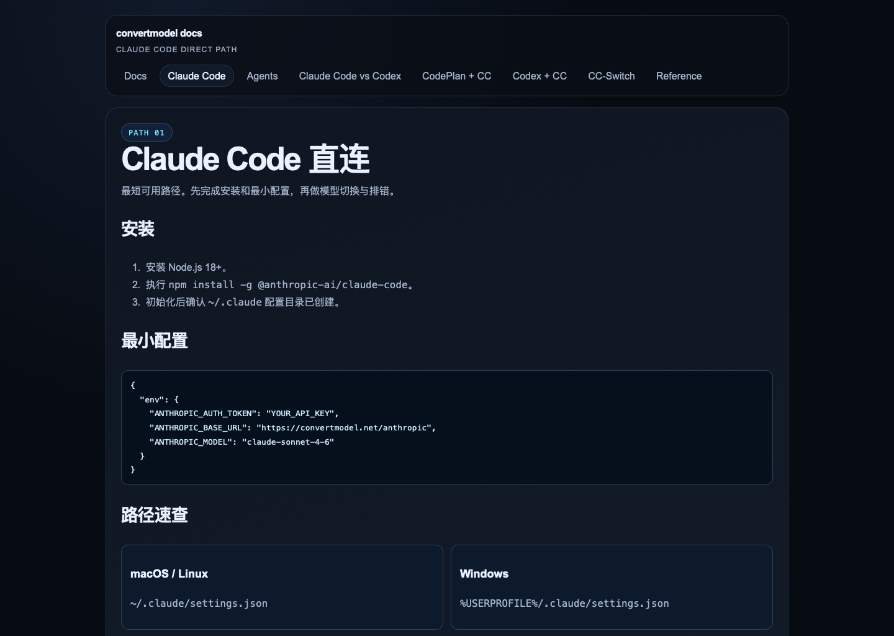
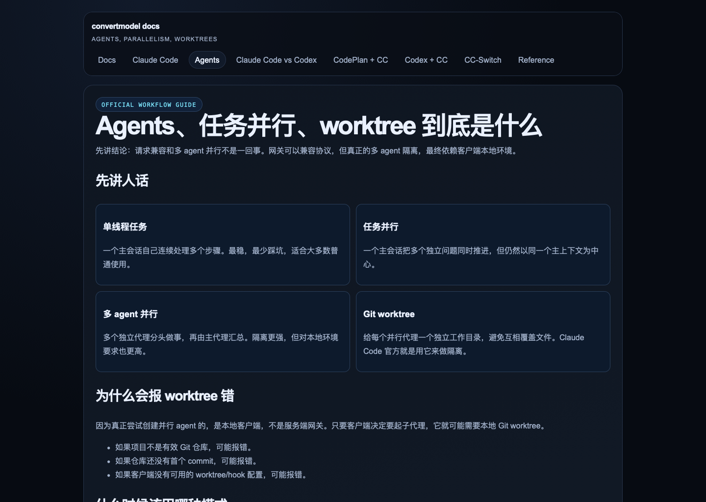
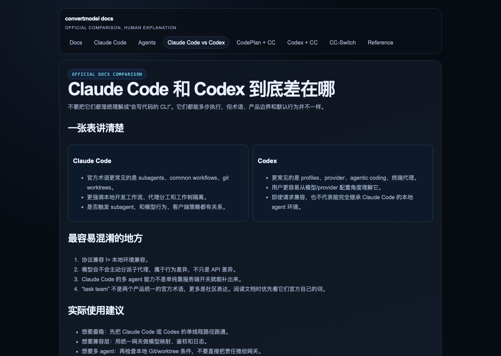

# cc-codex-plugin

把 **Codex 订阅** 转成 **Claude Code 可直接使用** 的入口。



你可以把它理解成：

- 你有 Codex 侧的能力或订阅
- 你还是想继续用 Claude Code
- 这个项目负责把两边接起来

这个仓库当前的重点不是 Docker，而是 **Claude Code 一键接入**。

## 一句话说明

**让 Claude Code 像平时一样用，但底层走的是 Codex 订阅。**

它不是官方插件市场插件。

它的实现方式是：

- 提供一个 bridge / 兼容层
- 提供一键安装脚本
- 自动把 Claude Code 指到这个 bridge

## 为什么要做这个

- 你想继续用 Claude Code
- 你想把底层接到 Codex 订阅
- 你不想每次都自己改配置文件

## 适合谁

- 想继续用 Claude Code，但订阅或上游想走 Codex 风格能力的人
- 想统一客户端接入方式的人
- 想把配置和桥接逻辑做成开源项目的人

## 最快用法：三步

### 1. 准备好你的 bridge 地址和 key

你需要知道两样东西：

- bridge 地址
- 访问这个 bridge 的 key

### 2. 执行安装脚本

直接执行：

```bash
curl -fsSL https://raw.githubusercontent.com/UnstoppableCurry/cc-codex-plugin/main/scripts/install-claude-code.sh | bash
```

脚本会：

- 询问你的 bridge base URL
- 询问你的 gateway key
- 可选设置默认模型
- 自动更新 `~/.claude/settings.json`
- 尽量保留你原本已有配置，只补需要的环境变量

### 3. 重启 Claude Code

重启之后，Claude Code 就会走你填写的 bridge。

## 用户最容易问的两个问题

### 1. 这能不能顺便解决多 agent / swarm？

不能完全解决。

它能解决的是：

- 请求兼容
- 配置接入
- 使用体验

但如果 Claude Code 本地真的要起多 agent，还是取决于你本机的 Git/worktree 环境。



### 2. Claude Code 和 Codex 到底差在哪？

它们都能做多步编码，但本地执行模型、术语和并行方式不是完全一样。



## 如果你不想跑脚本

手动参考：

- `examples/claude-code/settings.json`

把里面的内容合并进：

- `~/.claude/settings.json`

## 目录说明

- `scripts/install-claude-code.sh`：一键安装 Claude Code 配置
- `scripts/uninstall-claude-code.sh`：删除这套配置写入的 env 键
- `examples/claude-code/`：Claude Code 配置样例
- `examples/codex/`：Codex 配置样例
- `config.example.toml`：bridge 运行配置样例
- `docs/`：英文文档
- `docs/zh-CN/`：中文文档

## 自托管 bridge

如果你要自己运行 bridge：

```bash
cp config.example.toml config.toml
docker build -t cc-codex-plugin .
docker run --rm -p 8000:8000 \
  -v "$(pwd)/config.toml:/app/config.toml:ro" \
  cc-codex-plugin \
  ccproxy serve --config /app/config.toml --host 0.0.0.0 --port 8000
```

然后再用安装脚本或手动配置，把 Claude Code 指过去。

## 你最终得到的效果

你平时还是：

- 打开 Claude Code
- 正常提问
- 正常写代码

只是底层计费和能力入口，不再直接走原生 Claude 订阅，而是走你配置好的 Codex 侧 bridge。

## 重要限制

这个项目能解决的是：

- 请求格式兼容
- 接入体验
- 配置简化

它不能替代的是：

- Claude Code 本地的 `git worktree`
- 本地 subagent / swarm 所需的工作区隔离条件

也就是说：

普通请求链路可以通过 bridge 做兼容，但如果 Claude Code 本地要起多 agent，最终还是要满足本机环境要求。

## 中文文档

- [中文快速开始](./docs/zh-CN/quickstart.md)
- [中文模型映射说明](./docs/zh-CN/model-mapping.md)
- [中文限制说明](./docs/zh-CN/limitations.md)
